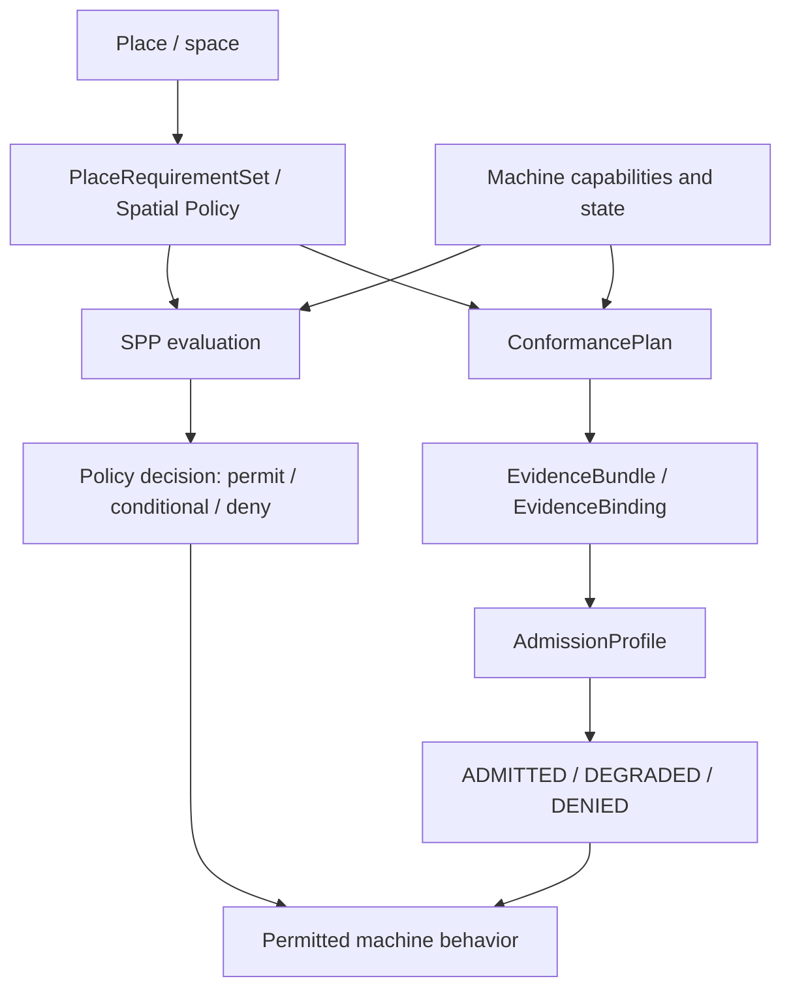

# PlaceAuth / Spatial Policy Protocol (SPP)

SPP is an experimental, open protocol that lets a physical place express machine-operational requirements and lets an autonomous system determine whether and how it may operate there. A place can constrain movement, sensing, data handling, manipulation, infrastructure use, and human interaction without changing the robot application. The reference implementation evaluates the place's policy and, where evidence-based admission is used, produces an operating profile for that specific place and context.

[](CHANGELOG.md)
[](docs/releases/SPP-0.3.0-experimental-preview.md)
[](https://www.python.org/downloads/)
[](LICENSE)

[Five-minute demo](#five-minute-demo) · [Specification](spec/SPP-0.1.md) · [Technical review](docs/technical-review.md) · [Whitepaper](docs/whitepaper.md) · [PDF Whitepaper](docs/whitepaper/PlaceAuth-SPP-White-Paper.pdf) · [Documentation](docs/README.md)

> **Latest published release:** SPP v0.3.0 Experimental Preview. The normative protocol specification remains SPP 0.1.

## Why this exists

Geofencing tells a machine where it may travel. Ordinary authorization establishes who may request an action. Static robot configuration and application-specific zone rules hard-code behavior into a particular deployment. SPP instead gives the place a machine-readable role in determining machine behavior at the time and scope of operation.

The core question is:

> May Actor X perform Action Y in Space Z under Context C?

## Five-minute demo

This is the canonical PlaceAuth demonstration. It runs locally with no service, simulator, robot, or Docker installation. It uses the same reference machine while the place changes its policy and requirements.

```sh
git clone https://github.com/placeauth/spatial-policy-protocol.git
cd spatial-policy-protocol
python -m pip install -r requirements-dev.txt
python demo/admission/run_demo.py --canonical
```

Expected result, abbreviated:

```text
LAYER A - PLACE POLICY CHANGES WHAT THE MACHINE MAY DO
PLACE: clinic/lobby
DECISION: PERMIT
BEHAVIOR: movement permitted

PLACE: clinic/staff-corridor
DECISION: CONDITIONAL
REQUIRES: clinic.staff_escort

PLACE: clinic/pharmacy
DECISION: DENY
BEHAVIOR: movement is not permitted

LAYER B - EVIDENCE-BASED ADMISSION
FLOW: PlaceRequirementSet -> ConformancePlan -> EvidenceBundle / EvidenceBinding -> AdmissionProfile
ADMISSION: ADMITTED
REUSED EVIDENCE: movement.max_speed
ADMISSION: DEGRADED
RESTRICTIONS: sensing.video.capture=disabled
ADMISSION: DENIED
WHY: failed:human_separation
```

Layer A evaluates actual inherited clinic policy. The lobby permits entry, the staff corridor requires an escort, and the pharmacy denies entry: the request changes because the place changes. Layer B follows the real reference admission path from requirements to a profile. The same machine reuses sufficient movement evidence when entering the patient wing; a failed nonessential data requirement disables video capture (`DEGRADED`), while a failed essential human-separation requirement prevents admission (`DENIED`).

Run the full deterministic test suite after the demo:

```sh
python -m pytest -q
```

For detailed scenario output, including the transition delta, see the [admission demo guide](demo/admission/README.md). The [clinic demo](demo/clinic/README.md) remains the focused policy/API/browser example.

## Architecture



The policy decision path is defined by SPP 0.1. The conformance and admission path is an experimental reference implementation: it assesses whether evidence is sufficient for a place's requirements and yields a scoped operating profile. A `DEGRADED` profile preserves explicit restrictions; a `DENIED` profile permits no operation through that admission path.

## Security and trust

The reference admission path fails closed when binding, integrity, freshness, policy/environment state, challenge use, or verified issuer checks do not pass. It supports local signed evidence and signed place-requirement verification with trusted issuer and policy-authority registries, plus profile lifecycle assessment and revocation in the reference model.

These are local/reference-grade trust mechanisms, not a production PKI, remote trust-discovery system, hardware attestation service, or physical-enforcement guarantee. Read [security considerations](spec/security.md), the [threat model](spec/threat-model.md), and [evidence sufficiency guidance](docs/evidence-sufficiency.md) before using SPP with physical systems.

## Current status

Implemented in the reference package:

- SPP 0.1 place policy, hierarchical inheritance, and `permit` / `conditional` / `deny` decisions for six initial action families;
- deterministic conformance planning, evidence binding, sufficiency assessment, selective requalification, and `ADMITTED` / `DEGRADED` / `DENIED` profiles;
- local signed evidence and place-requirement verification, explain traces, and bounded facility access-control decisions.

Experimental integrations and validation:

- an admission-to-Nav2 speed-limit adapter with bounded ROS 2/Nav2 runtime validation;
- Open-RMF task-eligibility gating with bounded runtime validation at the delivery-consideration boundary;
- a generic facility-side `AdmissionProfile` decision boundary, not physical door or building-system control.

Still planned or outside the current scope:

- an adopted industry standard, production PKI/identity, hardware attestation, distributed replay protection, and broad vendor interoperability testing;
- physical robot safety, stopping, enforcement, or building-hardware guarantees.

SPP is an emerging open protocol implementation for pre-standardization technical review, not a finished industry standard. Certain technologies described in this project are patent pending.

## Explore the repository

| Area | What it contains |
| --- | --- |
| [spec/](spec/) | SPP 0.1, security, threat model, and evidence-based admission specification |
| [examples/](examples/) | Home, hospital, warehouse, and hotel policy examples |
| [demo/admission/](demo/admission/) | Canonical evidence-based admission scenarios and details |
| [demo/clinic/](demo/clinic/) | Policy, API, and browser demonstration |
| [reference/](reference/) | Policy server, admission implementation, and experimental adapters |
| [docs/](docs/) | Implementation guides, release notes, technical review, and Whitepaper |
| [tests/](tests/) | Schema, policy, admission, integration-boundary, and runtime validation tests |

Use the [documentation index](docs/README.md) for independent implementation guidance, schemas, demos, security material, release notes, and the roadmap. The [SPP v0.3 release notes](docs/releases/SPP-0.3.0-experimental-preview.md) distinguish validated reference behavior from unproven deployment claims.

## Contributing

Please read [CONTRIBUTING.md](CONTRIBUTING.md), [CODE_OF_CONDUCT.md](CODE_OF_CONDUCT.md), and [SECURITY.md](SECURITY.md). Protocol feedback, reproducible implementation bugs, and interoperability proposals are welcome.

## License

SPP is licensed under the [Apache License 2.0](LICENSE).
