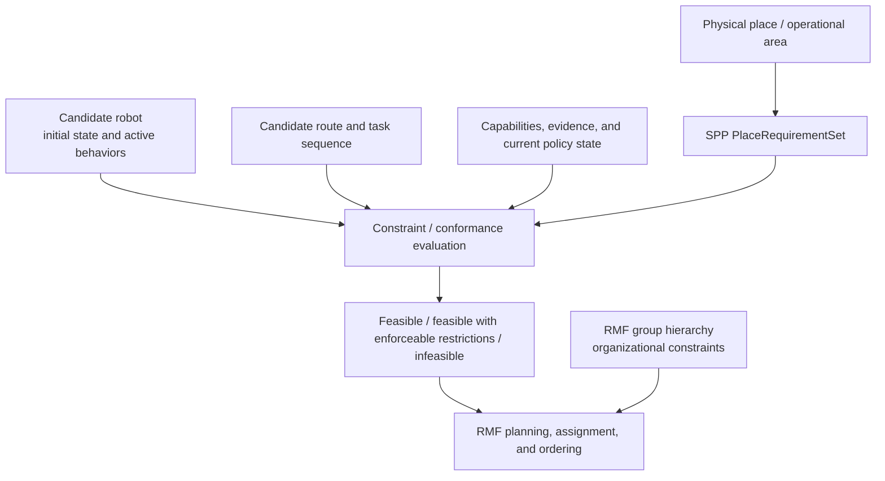

# SPP and Open-RMF Next Generation: Place-Originated Requirements and Hierarchical Groups

**Status:** Architectural exploration; not a protocol proposal or an Open-RMF adoption statement.
**Scope:** Existing SPP 0.1 and its experimental reference admission layer, considered alongside the Open-RMF Next Generation group concept described in maintainer discussion.

## Purpose

Open-RMF's current delivery-consideration hook is a useful decision boundary for SPP: it asks whether a fleet should consider a delivery request before offering a bid. The proposed Next Generation direction—hierarchical groups that carry inherited constraints—creates a related but distinct modeling question.

This note keeps two sources of meaning separate:

- **RMF groups** describe robot membership, organizational/fleet structure, and constraints or capabilities associated with those members.
- **SPP place requirements** are asserted by the physical place or operational area that a machine is attempting to enter or use.

For example, `Hospital -> Delivery Robots -> Vendor A Fleet` may identify a robot's organizational context. `Operating Room 3` may prohibit video capture, require authenticated control, and require a particular human-separation assurance level. The latter should apply to every qualifying machine attempting to operate in that room, regardless of fleet or group membership.

## Established behavior

### SPP

SPP 0.1 defines place-centered policy decisions for a requested actor, action, space, and context. Its reference admission layer is experimental and turns a place-defined `PlaceRequirementSet` into a `ConformancePlan`, then evaluates an `EvidenceBundle` and `EvidenceBinding` to produce an `AdmissionProfile`:

```text
PlaceRequirementSet -> ConformancePlan -> EvidenceBundle / EvidenceBinding -> AdmissionProfile
```

The result is `ADMITTED`, `DEGRADED`, or `DENIED`; it is scoped to the actor, place, space, policy version, evidence, and runtime bindings. A degraded profile carries explicit restrictions. A denied profile does not authorize operation through this admission path. The reference model also supports selective requalification when destination requirements change.

The reference implementation includes local signed-evidence and signed-place-requirement paths. Those mechanisms are not normative SPP 0.1 signatures and are not a PKI, identity federation, or proof of physical behavior.

### Current Open-RMF adapter

The current SPP adapter targets the Open-RMF Humble Python `FleetUpdateHandle.consider_delivery_requests` pickup/dropoff callbacks. A host resolver maps an RMF delivery description to `TaskContext(actor_id, place, space)`. A host admission callback supplies a freshly evaluated profile. The adapter accepts an eligible request or returns RMF errors for a rejection.

This is a bounded task-eligibility integration. It has been runtime-validated through delivery consideration and bid response with a minimal test fleet. It does not establish dispatch execution, traffic negotiation, physical motion, building integration, or an end-to-end production trust path. In particular, the current callback has no selected robot identity; a deployment must use a single-robot fleet or independently constrain actor assignment.

It also does not expose a candidate route, the robot's initial state, active behaviors, or task ordering. As supplied maintainer feedback observes, location-sensitive constraints may depend on all of those inputs. `consider_delivery_requests()` should therefore be treated as an early fleet/bid-consideration point, not a complete mechanism for path-dependent plan feasibility.

## Proposed conceptual boundary



The diagram is intentionally asymmetric. RMF group context may inform candidate selection and planning, but it does not become the authority for the place's requirements. The diagram is not a claim about a current or announced Next Generation API. It is a boundary proposal in which a deployment evaluates place-originated requirements against a candidate plan, while RMF separately decides whether and how to schedule work subject to its own constraints.

## Division of responsibility

| Concern | SPP boundary | RMF boundary |
| --- | --- | --- |
| Place and space requirements | Place authority publishes the requirement set and its scope. | The deployment's RMF integration resolves task intent into a place/space context; current RMF callbacks do not provide an SPP spatial model. |
| Machine/fleet organization | Treats actor and embodiment as evaluation inputs; does not define fleet taxonomy. | Defines group membership, inheritance, candidate selection, and scheduling. |
| Evidence and conformance | The experimental reference admission layer derives tests, evaluates evidence and bindings, and returns a scoped result. | May provide trusted current-state inputs or invoke an external service; should not fabricate evidence. |
| Candidate-plan feasibility | Describes portable requirements and conformance semantics; does not assign robots, generate routes, or order tasks. | Owns candidate generation, route/sequence construction, and the final feasibility decision for its plan. |
| Operational restrictions | States explicit admission restrictions. | Accepts only restrictions it can enforce for the task, route, or selected capability; otherwise fails closed. |
| Execution | Does not dispatch a robot. | Schedules and monitors tasks; downstream controls remain independently responsible for enforcement. |

This separation is a boundary choice, not a claim that the two hierarchies are intrinsically incomparable. A child RMF group may inherit an approved-controller rule or an organizational operating constraint. A child physical space may independently inherit or override place policy. They need not share a common tree.

### Skeptical alternative: use RMF groups only

An RMF maintainer could reasonably argue that a sufficiently expressive group model, task metadata, and deployment policy service can represent every constraint in this note. For a closed deployment in which the same operator owns the robots, groups, spaces, evidence source, and enforcement points, that may be the simpler design. SPP adds no value merely by renaming those rules.

The case for a separate SPP boundary is narrower: requirements originate with a place authority independent of fleet membership, apply across multiple fleets or non-RMF systems, and require a portable requirement/evidence/lifecycle contract. If those conditions are absent, RMF-native configuration should remain a valid and likely preferable option. The design must therefore avoid making an RMF group carry SPP concepts merely to justify SPP's presence.

## Recommended exchange shape

An `AdmissionProfile` remains useful for **bounded admission to a known place by a known robot**. It can carry actor/place/space scope, policy and evidence identifiers for audit, status, explicit restrictions, and reason codes. It may be enough for a door-access decision, a single-robot fleet, or a planner checkpoint once the relevant robot and spatial scope are already known.

It is too coarse to be the sole planner interface when feasibility depends on a route, ordering, or behavior state. A robot may be conformant with an area under one plan but not another: it might avoid the area, traverse it while a prohibited capability is active, reach it by a different route, or arrive in a different state after another task. A planner-facing evaluation may instead need the place requirements for every relevant scope intersected by the proposed route, candidate robot, initial state, task sequence, capabilities/evidence, and current policy state. Its conceptual result is feasibility, feasibility with enforceable restrictions, or infeasibility—not new SPP protocol enums.

The current reference profile is also not a production transport contract: it is a constructible Python dataclass, has no standalone expiry field, and is not itself signed. A trusted admission service or signed, time-bound decision envelope would be needed before an RMF process could treat a profile as authoritative.

Raw requirements can remain available as an optional, read-only SPP interface for planning, audit, or a deployment that deliberately wants RMF to initiate conformance. They should not be required in the RMF group model, copied into group inheritance, or treated as a universal RMF capability vocabulary. That would couple RMF to SPP requirement semantics and make non-RMF SPP deployments second-class.

Another valid design is for SPP to supply only place requirements and evidence/conformance information, while an RMF deployment owns the admission decision. That may fit an RMF architecture with a mature, candidate-aware policy service. It requires an explicit rule for who interprets essential requirements, degraded restrictions, evidence freshness, and requalification; it should not silently reinterpret a positive conformance result as permission. This note does not assume that SPP admission must be the only or final decision point.

No single component owns every operational decision. The place authority owns the requirements it asserts. When a deployment chooses SPP, its admission service can supply a conformance conclusion for those requirements. RMF owns whether work fits its scheduling, group, fleet, and traffic constraints. The robot runtime and facility controls own enforcement. A task proceeds only when all relevant boundaries allow it.

## Proposed Next Generation integration concept

This is a discussion model, not an API request. A cleaner Next Generation surface could optionally expose an external constraint/conformance query at three distinct points:

1. **Task consideration:** resolve any known pickup/dropoff or route intent into a place/space scope; reject only clearly impossible work early.
2. **Candidate-plan evaluation:** evaluate the selected candidate's identity, initial state, capabilities, bindings, evidence, route, and sequence. This is the important improvement over the current callback, which may not know the selected robot. A fleet-level consideration result is only early feasibility; it must not be represented as a robot-bound promise unless selection is constrained.
3. **Replanning/execution boundary:** recompute or revalidate after material state, route, ordering, destination, policy, or assignment changes before a restricted plan proceeds.

The query input can include candidate identity, initial state, task intent, route/sequence, resolved spatial scopes, evidence state, and relevant RMF group context. Its output should remain small and transport-neutral: a feasibility conclusion, restrictions, reason codes, and an opaque audit reference. SPP should not become the task planner: RMF or the deployment supplies and evaluates plans, assignments, and ordering. RMF need not parse every SPP requirement or become an SPP policy engine.

An RMF group can complement this gate: it can limit which candidates are eligible to be evaluated or establish organizational constraints independent of SPP. A deployment may associate group context with declared enforcement capabilities, but that declaration is not proof of enforcement. Group membership must not become proof that a machine satisfies a place requirement.

### Mapping degraded admission

`DEGRADED` is neither normal acceptance nor a general warning. It is eligible only if every restriction is explicitly accepted by trusted deployment configuration and that configuration identifies a real enforcement path for the intended task. The current mapper cannot verify that the path operates. Depending on the restriction, a deployment may need to exclude task categories, constrain a route/service/resource, select only a candidate with the required enforcement path, or reject the task when enforceability cannot be demonstrated.

The current adapter follows this principle: `DEGRADED` requires nonempty restrictions and exact configured acceptance; `DENIED`, missing, malformed, or scope-mismatched profiles fail closed. A Next Generation design should preserve that rule rather than convert `DEGRADED` into unrestricted eligibility.

### Replanning and invalidation

Candidate-plan conclusions cannot be assumed to survive replanning. At minimum, the deployment may need to recompute or revalidate when the selected robot, route, task order, relevant robot capability state, evidence validity, or applicable place requirements change. The reference lifecycle assessor already distinguishes `VALID`, `REVALIDATE`, `REQUALIFY`, and `INVALID` for an issued profile using current requirements, robot state, and evidence; it does not define a route- or task-sequence invalidation protocol, and the current RMF mapper does not invoke it. This note does not prescribe such a protocol.

## Trust and security boundaries

Group membership is not a trust anchor for either a place requirement or a conformance result. A deployment must separately authenticate the spatial authority, current place requirements, actor identity, machine state, evidence issuer, admission service, and time. The reference verified path uses locally provisioned Ed25519 authority and issuer keys; it does not provide remote key discovery, certificate lifecycle, distributed revocation, hardware attestation, or physical trust in evidence generation. The reference security model describes assurance from E0 declaration through E4 trusted external observation; the demo evidence is E2 behavioral evidence, not a safety claim.

The current RMF mapper checks profile structure, scope, status, and accepted restrictions. It cannot authenticate a caller-constructed profile or prove freshness, and it does not invoke the reference lifecycle assessor. The host must obtain a fresh result from a trusted admission path and revalidate when the selected robot, destination, policy, or relevant state changes. RMF confirmation alone does not enforce a restriction, and SPP alone does not cause a compromised runtime to comply.

## Questions for Open-RMF discussion

1. At what stage should location-sensitive constraints participate: candidate generation, cost evaluation, feasibility checking, another planner phase, or more than one?
2. What minimum candidate-plan context can an external policy/conformance evaluator safely receive?
3. How should a policy conclusion survive, invalidate, or be recomputed across replanning, reassignment, and task-order changes?
4. Should place constraints be treated as hard feasibility constraints, planner costs, capability restrictions, or some combination?
5. What are the intended inheritance and conflict-resolution semantics for groups, and which group context can an external evaluator safely receive?
6. Is there a stable task representation for deployment-resolved place/space context without requiring a new global spatial ontology?
7. Does RMF prefer raw declarative constraints, a constraint-evaluation service, conformance facts, an admission result, or some combination?
8. Who proves that a restricted/degraded plan can actually enforce every restriction, and how are enforcement failures surfaced?
9. Can RMF distinguish an early fleet-level refusal from a candidate-specific refusal without leaking sensitive place-policy detail to untrusted clients?
10. What mechanism prevents a post-bid reassignment from treating one robot's profile or plan conclusion as authorization for another robot?
11. What audit identifiers and retention model correlate RMF decisions with admission evaluations without placing raw evidence or sensitive place requirements in RMF task messages?

## Open issues and limits

The existing SPP reference implementation complicates a production-quality RMF boundary in several useful ways. `AdmissionProfile` is a constructible local dataclass with no standalone expiry field, so a transport contract would need a trusted issuer/service and explicit currentness semantics. The lifecycle assessor can return `VALID`, `REVALIDATE`, `REQUALIFY`, or `INVALID`, but the current RMF mapper does not call it. The current RMF hook is fleet-level and may not know the eventual robot identity. Restriction strings are intentionally deployment-defined rather than a standard RMF capability taxonomy. The place-requirement reference model currently has no separate parent/inherited-policy reference graph, even though SPP Core policy supports hierarchical spaces.

These are design questions, not reasons by themselves to introduce a second policy system. Where the stated cross-fleet/place-authority conditions justify SPP, a defensible boundary is: RMF supplies candidate and task context; an SPP-capable admission service evaluates place-originated requirements; RMF and downstream controls accept and enforce only behavior they can actually support.

## Reference material

- [Current Open-RMF admission adapter](../open-rmf.md)
- [Evidence sufficiency and admission boundaries](../evidence-sufficiency.md)
- [SPP security considerations](../../spec/security.md)
- [Evidence-based spatial admission specification](../../spec/evidence-based-admission.md)
